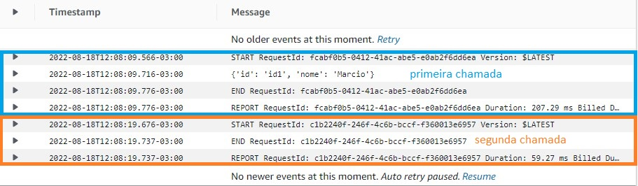

# cdk-playground-py

## Upgrade project
* python .projenrc.py

## idempotency-py

Projeto de teste de idempotência com o lambda-powertools-python

Entrar no lambda e submeter um body com qualquer coisa, mas precisa ter o **id**

```json
{
  "id": "id1",
  "nome": "Marcio"
}
```
<br/>



<hr/>